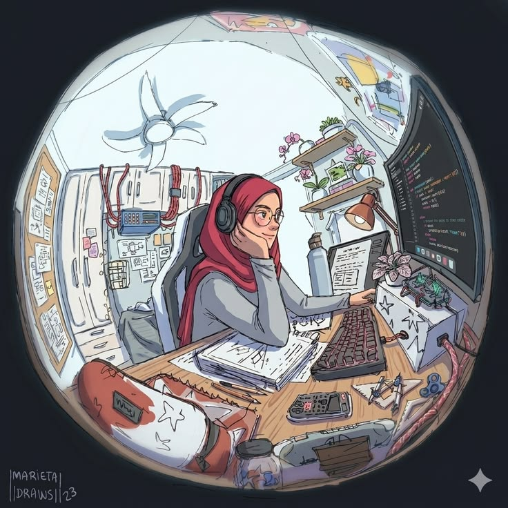

<h1 align="center">Hi, I'm Samar Hajjaji 👋</h1>

<table>
  <tr>
    <td width="38%" valign="top">
      
    </td>

    <td width="62%" valign="top">
      <h2>👩‍💻 About Me</h2>

      

        I am a third-year Computer Science and Technology student at
        Nanjing University of Posts and Telecommunications (NJUPT).
      

      

        I have been studying in China since 2023. I first studied Chinese
        at Zhejiang University of Technology before moving to Nanjing to
        continue my Computer Science and Technology studies.
      

      

        💻 Working with C++ and Java 
        ⚙️ Learning Assembly Language 
        🐍 Currently learning Python 
        🏃 Interested in sports and new experiences 
        🌱 Independent and consistent learner
      

      

        <a href="https://github.com/SAMARHAJJAJI">GitHub</a>
        •
        <a href="https://www.linkedin.com/in/samar-hajjaji-083a2b380/">LinkedIn</a>
      

    </td>
  </tr>
</table>

 🌍 My Journey

- 🇨🇳 Studying in China since 2023
- 🗣️ Completed one year of Chinese-language study at Zhejiang University of Technology
- 🎓 Currently studying Computer Science and Technology at NJUPT
- 💻 Building my programming and problem-solving skills
- 🌱 Learning through university courses, personal practice, and projects
- 🏃 Interested in sports, exploration, and personal development

<a href="https://github.com/SAMARHAJJAJI">GitHub</a> •
<a href="https://www.linkedin.com/in/samar-hajjaji-083a2b380/">LinkedIn</a>

  </td>
  </tr>
</table>

 🛠️ Programming Skills

 Languages

- C++
- Java
- Assembly Language
- Python — currently learning

 Tools

- Git
- GitHub
- GitHub Desktop
- Visual Studio Code
- IntelliJ IDEA
- Visual Studio

 Currently Developing

- Object-Oriented Programming
- Data Structures and Algorithms
- Problem Solving
- Low-Level Programming
- Software Development Fundamentals

 📚 Current Work

 C++ Practice

Practising C++ programming, problem solving, data structures, and algorithms.

 Java Practice

Developing my understanding of Java, object-oriented programming, classes, methods, and application structure.

 Assembly Language

Learning low-level programming concepts, registers, instructions, memory, and computer architecture.

 Python Learning

Currently learning Python fundamentals and improving through exercises and small programs.

 🎯 Current Goals

- Improve my C++ and Java programming skills
- Strengthen my understanding of data structures and algorithms
- Develop a better understanding of Assembly Language
- Continue learning Python
- Build complete and well-documented programming projects
- Improve my Git and GitHub skills
- Prepare for future internships and collaboration opportunities

 🏃 Beyond Coding

Outside technology, I enjoy sports and discovering new places, ideas, and experiences.

Studying abroad has helped me become more independent, adaptable, and willing to learn from unfamiliar situations.

 📫 Contact

I am open to student collaborations, learning opportunities, and future internships.

- GitHub: [SAMARHAJJAJI](https://github.com/SAMARHAJJAJI)
